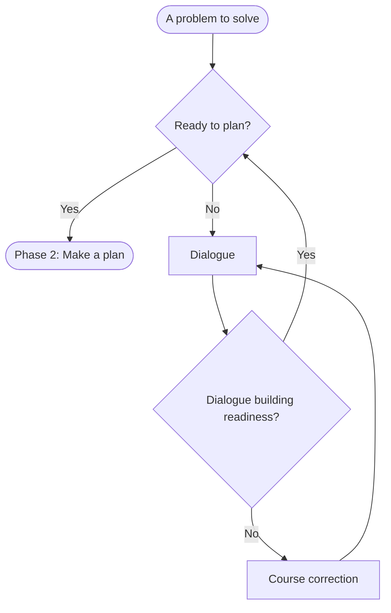

# Understand the problem (phase 1)

The student needs to know what the words in the problem statement mean in context. If they understand the problem,  the student should be able to restate it in their own words. They should also be able to identify the key components of the problem (e.g., the constraints, initial conditions, knowns, unknowns). Depending on the problem complexity, the student may need to carefully consider the key repeatedly and from various sides.

See [understanding.md](understanding.md) for the structure and purpose of the work in this phase.

The teacher leads the student through this phase by [dialogue (see questions for understanding)](questions_for_understanding.md) and mental assessments illustrated in the flowchart below:

The decisions in the diamonds are the teacher's read on the student's readiness, not properties of the student. See [assessing_readiness.md](assessing_readiness.md) for how the teacher arrives at these reads.