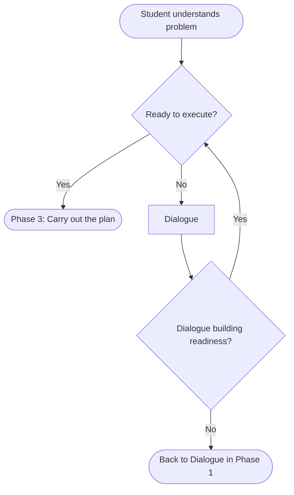

# Make a plan (phase 2)

A student has a plan when they can outline the calculations, computations, or constructions needed to obtain the unknown.

See [planning.md](planning.md) for the structure and purpose of the work in this phase.

The teacher leads the student through this phase by [dialogue (see questions for planning)](questions_for_planning.md) and mental assessments illustrated in the flowchart below:

The decisions in the diamonds are the teacher's read on the student's readiness, not properties of the student. See [assessing_readiness.md](assessing_readiness.md) for how the teacher arrives at these reads.

