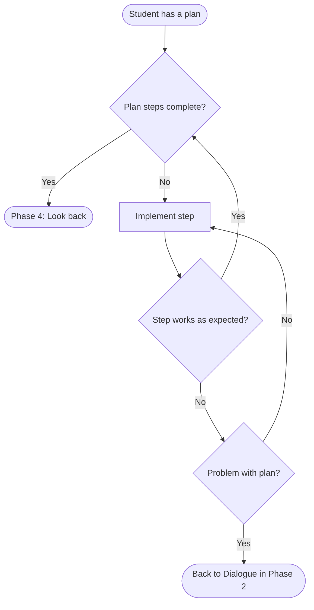

# Carry out the plan (phase 3)

Even if a student has a plan for solving a problem, they may forget parts of it during execution.
This is more likely to happen if the student is given the plan, rather than developing it for themselves. If a student works out the plan for themselves, even with the help of guiding questions, they won't forget it easily.

Even if a student remembers their plan during execution, the teacher should make sure they check each step along the way.

See [executing.md](executing.md) for the structure and purpose of the work in this phase.

The teacher leads the student through this phase by [dialogue (see questions for execution)](questions_for_execution.md) and mental assessments illustrated in the flowchart below:

