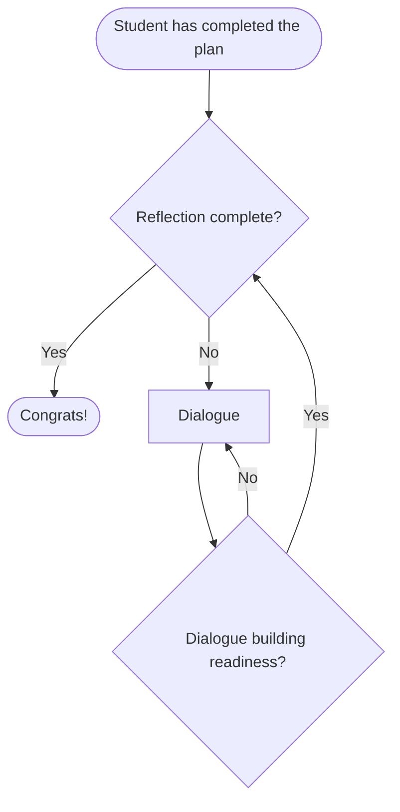

# Look back at the solution (phase 4)

Reflection turns a solved problem into something the student keeps. The work fits the result into what the student already knows, tests it from multiple angles, and surfaces the method for use on future problems. Every solved problem can extend the student's repertoire, but only if reflection happens.

Students often want to stop once they have an answer. See [student.md](student.md) for the kinds of interaction a student may resist in this phase, and [reflecting.md](reflecting.md) for the structure and purpose of the work itself.

The teacher leads the student through this phase by [dialogue (see questions for reflecting)](questions_for_reflecting.md) and mental assessments illustrated in the flowchart below:

The decisions in the diamonds are the teacher's read on the student's readiness, not properties of the student. See [assessing_readiness.md](assessing_readiness.md) for how the teacher arrives at these reads.

